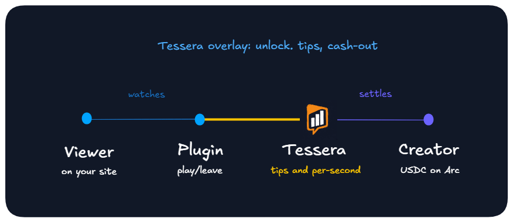

<div align="center">
  
  <br><br>

  <strong>USDC support engine for self-hosted platforms</strong>
  <br>
  <em>Optional tips on free content. Per-second support on exclusives. Sidecar plus a plugin on your instance.</em>
  <br><br>

  <a href="https://github.com/JaDi03/tessera/actions"></a>
  <a href="https://github.com/JaDi03/tessera/releases"></a>
  <a href="https://github.com/JaDi03/tessera/blob/main/LICENSE"></a>
  <br>
  <a href="https://nodejs.org/"></a>
  <a href="https://www.typescriptlang.org/"></a>
  <a href="https://developers.circle.com/gateway/nanopayments"></a>
  <a href="https://docs.arc.network"></a>
</div>

---

**[Live Playground](https://try-tessera.xyz)** · **[Documentation](https://jadi03.github.io/tessera/)**

Self-hosted platforms own the stack, then lose the audience to platforms that can take money. Tessera sits next to your instance so fans can support creators and hosts in USDC.

https://github.com/user-attachments/assets/a85f14af-b1aa-4657-8f52-83f9ebd1c297

## Who gets what

| | What they get |
|---|---|
| **Instance admin** | A configurable share of per-second support to help cover hosting |
| **Creator** | Tips on free content. Per-second support on exclusives. USDC to their wallet |
| **Fan** | Free content stays open; tip is one tap when they choose. On exclusives they pay for the seconds they watch |

## How support works

| | Free (`tessera:free`) | Exclusive |
|---|---|---|
| Player | Stays open | Unlocks after a USDC deposit |
| Billing | None until they tip | Per second while they watch |
| Tip | Manual, one tap | Same leftover Gateway balance |

On exclusives, creators and instance admins can share per-second earnings. Tips go to the creator. Leave ends billing. Replay works. Cash-out sends leftover USDC to the viewer's wallet.

## Live plugins

Install Tessera, then the plugin for your platform. Settings and screenshots live in each repo.

| Platform | Modes | Plugin |
|---|---|---|
| [PeerTube](https://joinpeertube.org/) | Per-second + tips | [peertube-plugin-tessera](https://github.com/JaDi03/peertube-plugin-tessera) |
| [Jellyfin](https://jellyfin.org/) | Per-second + tips | [jellyfin-plugin-tessera](https://github.com/JaDi03/jellyfin-plugin-tessera) |
| [Piwigo](https://piwigo.org/) | Tips on public photos | [piwigo-plugin-tessera](https://github.com/JaDi03/piwigo-plugin-tessera) |

Another host: a connector that calls `sessions/start`, `sessions/stop`, and `tips`. Contract: [CONNECTOR_SPEC.md](CONNECTOR_SPEC.md).

<p align="center">
  
</p>

<p align="center"><em>The plugin reports play and leave. Tessera's overlay handles unlock, tips, and cash-out. Settlement is USDC on Arc Testnet.</em></p>

## Why Arc Testnet

Ticks are off-chain each second. Deposit and cash-out use USDC for gas. Circle CCTP can fund the SCA from Ethereum Sepolia, Base Sepolia, or Arbitrum Sepolia.

More: [docs/ARCHITECTURE.md](docs/ARCHITECTURE.md)

## Quick start

Run Tessera, then install the plugin for your platform. Use the same ingest secret in both.

```bash
git clone https://github.com/JaDi03/tessera.git
cd tessera
npm install
cp .env.example .env
# CIRCLE_API_KEY, CIRCLE_APP_ID, MASTER_KEY, TESSERA_INGEST_SECRET
npm run build
npm start
```

Plugin repos are in the table above. Env, Base URL, and `deploy.sh`: [Getting Started](https://jadi03.github.io/tessera/getting-started/). Overlay login: [Viewer wallet](https://jadi03.github.io/tessera/tutorials/viewer-wallet/).

## License

Apache-2.0. See [LICENSE](LICENSE).
