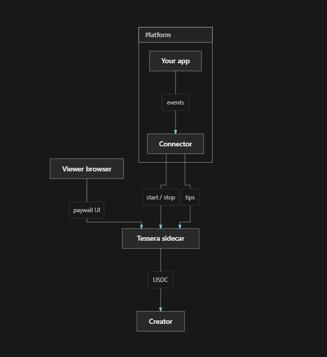

<div align="center">
  
  <br><br>

  <strong>USDC support engine for self-hosted platforms</strong>
  <br><br>

  <!-- Row 1: Status Badges -->
  <a href="https://github.com/JaDi03/tessera/actions"></a>
  <a href="https://github.com/JaDi03/tessera/releases"></a>
  <a href="https://github.com/JaDi03/tessera/blob/main/LICENSE"></a>
  <br>
  <!-- Row 2: Tech Stack Badges -->
  <a href="https://nodejs.org/"></a>
  <a href="https://www.typescriptlang.org/"></a>
  <a href="https://developers.circle.com/gateway/nanopayments"></a>
  <a href="https://docs.arc.network"></a>
</div>

---

**[Documentation](https://jadi03.github.io/tessera/)** · See how it feels → **[Live Playground](https://try-tessera.xyz)**

---

## What is Tessera?

Self-hosted platforms publish great content, but turning audience support into sustainable revenue is hard: high fees, SaaS lock-in, or paywalls that punish casual viewers.

Tessera is a **USDC support engine** that runs as a sidecar on **Arc Testnet** (MVP). Your platform keeps its UI; a connector translates native events (play, stop, tip) into HTTP calls. Viewers stay on your app; creators and instance admins get paid in testnet USDC.

| Who | What they get |
|---|---|
| **Admins** | Configurable share on time-based content (helps cover hosting) |
| **Creators** | Direct support via tips or per-second billing on exclusives |
| **Viewers** | Optional tips on free content; pay only for the seconds they watch |

https://github.com/user-attachments/assets/a85f14af-b1aa-4657-8f52-83f9ebd1c297

## Billing modes

**Tips (free content)** — The resource stays open. Tessera adds an optional USDC tip button. One gesture, one payment to the creator.

**Per-second (exclusive content)** — Tutorials, courses, premieres: billing runs while the viewer consumes and stops when they leave. Ten minutes watched means ten minutes of support, not a full-course purchase. When creator and instance admin differ, the default split is about **90% creator / 10% instance** (configurable in the connector).

## Connect any platform

Tessera does not ship inside your codebase. Any stack that can observe consumption events can integrate via a plugin or webhook.

| Surface | Examples |
|---|---|
| Video / live | [PeerTube](https://joinpeertube.org/) ([plugin](https://github.com/JaDi03/peertube-plugin-tessera)), Jellyfin, Owncast |
| Audio / podcast | Navidrome, Funkwhale, Castopod |
| Photos | Immich, PhotoPrism |
| Posts / publishing | Ghost, WriteFreely |

**Integration:** three HTTP endpoints — `sessions/start`, `sessions/stop`, `tips` — plus HMAC on time-based calls. Full contract: [CONNECTOR_SPEC.md](CONNECTOR_SPEC.md). No fork of Tessera required.

### Architecture

<p align="center">
  
</p>

<p align="center"><em>Platform events flow through a connector to the Tessera sidecar. The paywall UI runs in the viewer's browser. USDC settles to the creator.</em></p>

---

## Why Arc

On traditional rails, a small tip dies in fees. On **Arc Testnet**, gas is USDC and network costs are on the order of cents. With Circle Gateway, support runs **off-chain** while people consume, so you are not paying a network fee for every tip or every second.

More detail: [ARCHITECTURE.md](docs/ARCHITECTURE.md)

---

## Quick start

**Run Tessera** (instance operator):

```bash
git clone https://github.com/JaDi03/tessera.git
cd tessera
npm install
cp .env.example .env
# Fill CIRCLE_*, MASTER_KEY, TESSERA_INGEST_SECRET
npm run build
npm start
```

**Build a connector** (platform developer): your plugin needs Tessera’s **Base URL** and the same **ingest secret** as `.env`. See [Getting started §3](docs/getting-started/index.md#3-tessera-base-url) and the [integration contract](CONNECTOR_SPEC.md).

Install, env, and deploy: [Getting started](https://jadi03.github.io/tessera/getting-started/).

---

## License

Apache-2.0 - see [LICENSE](LICENSE) for details.
