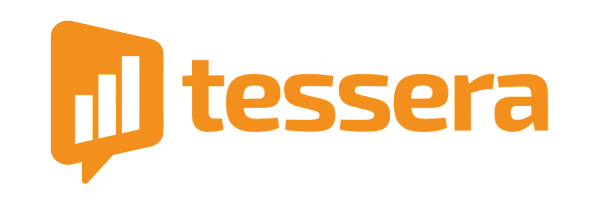
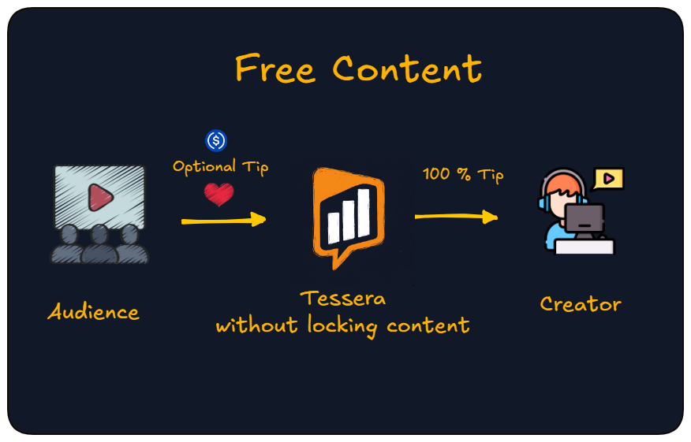
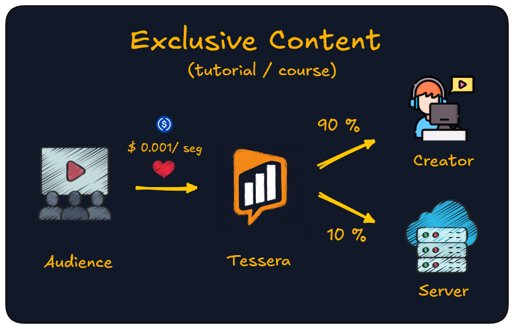

<div align="center">
  
  <br><br>

  <strong>Support sidecar for self-hosted open-source platforms</strong>
  <br><br>

  <!-- Row 1: Status Badges -->
  <a href="https://github.com/JaDi03/tessera/actions"></a>
  <a href="https://github.com/JaDi03/tessera/releases"></a>
  <a href="https://github.com/JaDi03/tessera/blob/main/LICENSE"></a>
  <br>
  <!-- Row 2: Tech Stack Badges -->
  <a href="https://nodejs.org/"></a>
  <a href="https://www.typescriptlang.org/"></a>
  <a href="https://developers.circle.com/gateway/nanopayments"></a>
  <a href="https://docs.arc.network"></a>
  <br><br>

  <a href="https://jadi03.github.io/tessera/">Documentation</a>
  ·
  <a href="https://try-tessera.xyz">Live Playground</a>
</div>

---

## In one sentence

Tessera is a support sidecar for open content (video, podcasts, posts, and more). Your audience can support creators and instance admins in USDC without forking the platform.

- **Free content stays free**: optional tip.
- **Exclusive content** (tutorial, course, masterclass): support **by the second watched**. If someone watches 10 minutes and leaves, they only support those 10 minutes. No full-course purchase. No fixed subscription.

Free stays free. Support is optional and fair to the time watched.

---

https://github.com/user-attachments/assets/a85f14af-b1aa-4657-8f52-83f9ebd1c297

---

## Contents

- [Why it exists](#why-it-exists)
- [How audiences can support](#how-audiences-can-support)
- [Platforms today](#platforms-today)
- [Beyond video](#beyond-video)
- [Why Arc](#why-arc)
- [Quick start](#quick-start)
- [License](#license)

---

## Why it exists

Self-hosted platforms give you freedom, but keeping servers online is expensive. Supporting a creator with the usual options often means high fees or getting locked into a payment SaaS.

Tessera is not a tollbooth. It is a **support layer** for the free software ecosystem: optional tips, time-based support on exclusives, and a way for instances and creators to sustain what they publish.

| Who | What they get |
|---|---|
| **Admins** | Help keep the lights on (configurable split on exclusive / time-based mode) |
| **Creators** | Direct audience support (tips or by time) |
| **Audience** | Support only what they consume; leave anytime |

---

## How audiences can support

### 1. Tips on free content

The resource **stays open**. Tessera only offers an optional USDC tip. Works for free videos, posts, photos, wikis, podcasts…



*Tips go to the creator.*

### 2. Time-based support on exclusive content

For tutorials, courses, or premieres: the audience supports **while watching** and can leave anytime. Ten minutes watched means ten minutes of support.

When the creator and the instance admin are **not the same person**, the default split is about **~90% creator / ~10% instance** (configurable; helps cover hosting).



---

## Platforms today

| Platform | Integration | Status |
|---|---|---|
| [PeerTube](https://joinpeertube.org/) | Plugin | Live |
| [Jellyfin](https://jellyfin.org/) | Plugin | In development |

Tessera is a payment engine sidecar. Platforms integrate via plugin or native webhook calling the [HTTP contract](CONNECTOR_SPEC.md).

---

## Beyond video

With tips, any FOSS content can ask for support without locking the page: blogs (Ghost, WriteFreely), wikis (BookStack), photos (Immich), audio (Funkwhale, Castopod, Navidrome), and more.

New platform: implement the [integration contract](CONNECTOR_SPEC.md) (`sessions/start|stop` + HMAC). No Tessera code changes required.

---

## Why Arc

On traditional rails, a small tip dies in fees. On **Arc**, gas is USDC and network costs are on the order of cents. With Circle Gateway, support runs **off-chain** while people consume, so you are not paying a network fee for every tip or every second.

More detail: [Documentation](https://jadi03.github.io/tessera/) · [ARCHITECTURE.md](docs/ARCHITECTURE.md)

---

## Quick start

```bash
git clone https://github.com/JaDi03/tessera.git
cd tessera
npm install
cp .env.example .env
# Fill CIRCLE_*, MASTER_KEY, TESSERA_INGEST_SECRET
npm run build
npm start
```

Install, env, and deploy: [Getting started](https://jadi03.github.io/tessera/getting-started/).

---

## License

Apache-2.0 - see [LICENSE](LICENSE) for details.
