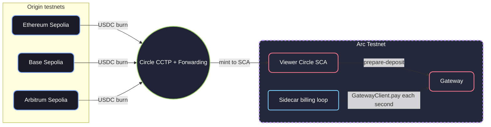

# Architecture & Fees

## Architecture

Tessera settles per-second support on **Arc Testnet** through Circle Gateway. Viewers can fund the Circle SCA on Arc directly, or bridge USDC in with Circle CCTP (Bridge Kit + Forwarding) from Ethereum Sepolia, Base Sepolia, or Arbitrum Sepolia. CCTP mints to the SCA; Tessera then deposits that USDC into Gateway (`prepare-deposit`).

## Fee Structure

Billing ticks are off-chain. Each second the sidecar signs with the ephemeral Gateway key (`GatewayClient.pay` to `POST /api/core/stream-access`). Ticks do not cost Arc gas.

On-chain USDC movement for a typical exclusive session:

1. **Deposit (Gateway funding):** SCA USDC into Gateway (`prepare-deposit`), or leftover ephemeral-wallet USDC via `register-session`.
2. **Cash-out (optional):** Manual withdraw of unused Gateway balance back to the SCA. Leaving the player (`sessions/stop`) does **not** withdraw. Creator earnings already moved on each billing tick.

SCA USDC can also go to an external address via `quote-external-withdraw` / `prepare-external-withdraw` (Circle challenge, then `poll-challenge`).

Those Arc transactions use USDC for gas. Tessera keeps a small buffer on the ephemeral wallet (`RETAINED_GAS_AMOUNT`, default 0.01 USDC) so deposit and cash-out can pay gas. Arc's published target is about **$0.01 USDC** per transaction.

**CCTP (optional):** Bridge Kit burns on the source chain and Circle Forwarding mints on Arc. The Forwarding fee is **0.20 USDC**. The mint credits the SCA; Gateway funding is still `prepare-deposit`.

---

**Why Arc Testnet**

Tessera bills **per second**. Settlement runs on Arc Testnet (`@circle-fin/x402-batching`, `eip155:5042002`) so ticks can stay off-chain while deposit and cash-out use USDC gas.

- **Native USDC gas:** Deposit and cash-out pay gas in USDC. No extra native token.
- **Low per-tx cost:** Arc targets about **~$0.01 USDC** gas.
- **Gasless ticks:** After Gateway is funded, `GatewayClient.pay` runs once per second with no wallet popup.
- **Why Arc:** A 10-minute exclusive session is hundreds of ticks. On-chain gas per tick would dwarf the content rate.

### Environment Configuration
- **`PUBLIC_URL`:** Public origin of the sidecar. Circle auth cookies are `Secure` when this is `https://`, or when `COOKIE_SECURE=true`, or when `NODE_ENV=production`.
- **Gas Buffer:** `RETAINED_GAS_AMOUNT` (default 0.01 USDC) keeps USDC on the ephemeral wallet so on-chain deposit/cash-out can pay Arc gas.

### Security & Performance
- **Ingest HMAC:** `POST /api/core/v1/sessions/start` and `stop` require `TESSERA_INGEST_SECRET`. Tips and session money routes use Circle wallet proof (`userToken` + `returnAddress`).
- **USDC deposits:** `POST /api/core/circle/prepare-deposit` transfers USDC only.
- **Rate limiting:** Session routes (`register-session`, `start`/`stop`, `tips`, `end-session`, `cash-out`, `topup-session`) share an IP limiter. `sync-session` has its own. Circle routes use a separate IP limiter.
- **Session store:** The ephemeral Gateway key survives `sessions/stop`. `cash-out` withdraws leftover USDC to the SCA and then clears the record.
- **Dynamic top-up:** Viewers can add Gateway balance without leaving the overlay (`topup-session`).

### Observability
- **Healthcheck:** `GET /health` returns sidecar version, a ping to `https://api-testnet.circle.com/ping`, and active session count.
- **Challenge confirmations:** After deposit or cash-out, the overlay calls `POST /api/core/circle/poll-challenge` until the status is `COMPLETE`, `FAILED`, or `EXPIRED`.
