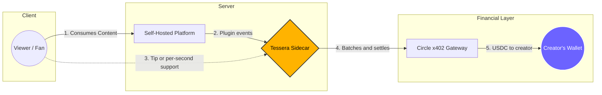
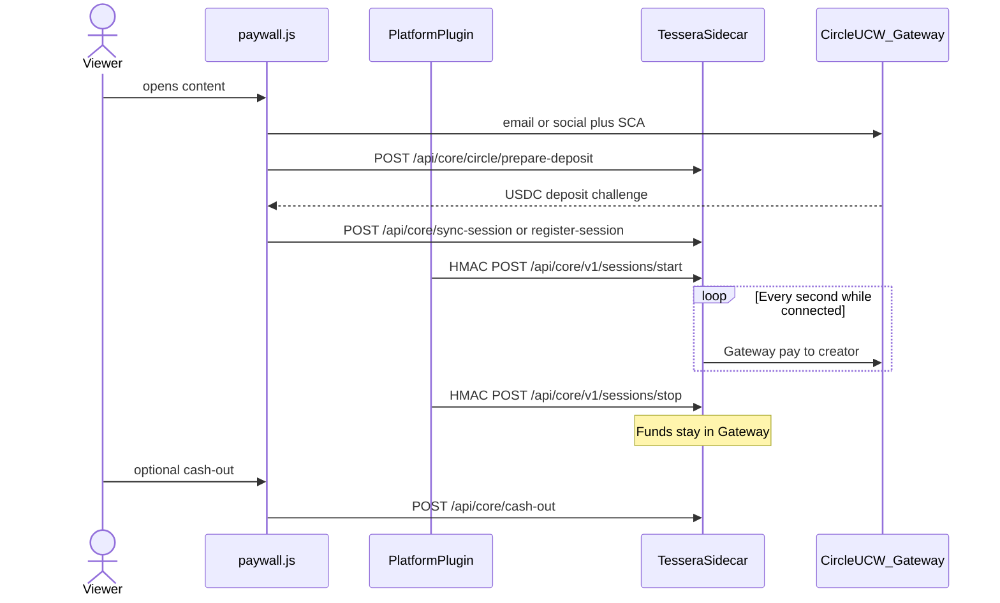

**USDC support engine for self-hosted platforms**

*Per-second and one-off support on [Circle x402](https://www.circle.com/nanopayments) and [Arc](https://www.arc.network)*

---

## TL;DR

Tessera sits next to your self-hosted platform so audiences can support creators and instance hosts in USDC: an optional tip on free content, or per-second support on exclusives.

The sidecar does not replace your app. A platform plugin loads the Tessera overlay and tells the sidecar when someone starts, stops, or tips. You install that plugin on the platform; you do not fork Tessera.

---

## The Problem

Self-hosted platforms give communities ownership, but they leave a gap: **there is no native way for audiences to support the infrastructure and creators they value.**

| Stakeholder | Pain Point |
|---|---|
| **Instance Administrators** | Bear 100% of infrastructure costs (servers, storage, bandwidth) with few tools beyond donations or ads |
| **Creators** | Publish on platforms they do not control, with no built-in path to direct support from their audience |
| **Viewers / Readers** | Want to support people they follow, but platform-wide subscriptions do not match what they actually consume |

Instances shut down when admins can no longer afford them. Creators move to commercial platforms. Communities fragment.

---

## The Solution

Tessera is a **USDC support engine**: a sidecar next to your platform, plus a plugin that loads the overlay. Free items stay open (`tessera:free`) with a manual tip. Exclusive items ask for a USDC deposit, then bill by the second while the viewer stays.

**How support works:**

- **Free content** (`tessera:free`): no lock, no billing. Tip is manual only
- **Exclusive content**: viewer deposits USDC, then per-second support while they stay. Leave and replay do not freeze the player
- **Gas-free ticks**: the sidecar authorizes a nanopayment each second; settlement is batched
- **Cross-chain funding**: viewers can fund via Circle CCTP; settlement is on Arc Testnet

---

## How It Works

**In plain terms:**

1. **Viewer opens content** → The platform plugin loads the Tessera overlay (`paywall.js`).
2. **Viewer funds support** → Circle UCW (email OTP or social) creates an SCA on Arc Testnet. Exclusive content uses `POST /api/core/circle/prepare-deposit` (USDC) and a Circle challenge.
3. **Session key** → The overlay calls `POST /api/core/sync-session` (returning viewer) or `POST /api/core/register-session` (new key). Both prove Circle wallet ownership. Register may also deposit leftover SCA USDC into Gateway.
4. **Support ticks off-chain** → The plugin sends HMAC-signed `POST /api/core/v1/sessions/start`. Each second Tessera authorizes a nanopayment to the creator `payoutAddress`. `POST /api/core/v1/sessions/stop` (also HMAC) ends billing.
5. **Viewer leaves** → Funds stay in Gateway. A manual `POST /api/core/cash-out` returns unused USDC to the viewer's SCA. Tips use `POST /api/core/v1/tips` with Circle proof.

HMAC header details and the connector contract: [Connector spec](connectors/spec.md).

---

## Integrated Platforms

Tessera is live on PeerTube, Jellyfin, and Piwigo. Plugin install lives in each repo: [Integrated Platforms](platforms/index.md).

---

## Tech Stack

| Technology | Purpose | Why It Matters |
|---|---|---|
| [**Circle x402 Gateway**](https://developers.circle.com/gateway/nanopayments) | Batched settlement | USDC support as small as $0.000001 using HTTP 402 |
| [**Circle UCW SDK**](https://developers.circle.com/wallets/user-controlled) | Smart Contract Accounts on Arc Testnet | Non-custodial wallets with email OTP or social login |
| [**Circle CCTP Forwarding**](https://www.circle.com/cross-chain-transfer-protocol) | Cross-chain USDC bridging (Domain 26) | Viewers can fund USDC from a supported source chain |
| [**Arc Testnet**](https://docs.arc.network) | Settlement layer (Chain ID 5042002) | Native USDC gas, sub-second finality |
| [**EIP-3009**](https://eips.ethereum.org/EIPS/eip-3009) | Off-chain transfer authorization | Gasless signatures for per-second ticks |
| [**viem**](https://viem.sh/) | Type-safe EVM interactions | TypeScript library for chain calls |
| [**Express**](https://expressjs.com/) | Web application server | Node.js HTTP for the sidecar |

---

## Architecture Summary

Tessera uses a **sidecar pattern**. Two layers in this repo:

**Core Engine** (`src/core/`) - Session management, per-second billing, wallet ops, Circle Gateway / x402.

**Client Overlay** (`src/ui/`) - Overlay UI. Platforms load it from `/assets/`.

Platform plugins live outside this repo and call the HTTP contract.

Diagrams, fees, and settlement: [docs/ARCHITECTURE.md](ARCHITECTURE.md).

---

## What This Enables

- **Creators** get direct support (tips on free items, per-second on exclusives). Earnings accumulate in Gateway, then the creator withdraws to their wallet
- **Admins** can take a configurable share on time-based content to help cover hosting
- **Viewers** tip only if they want on free content, and pay only for the seconds they watch on exclusives. No platform-wide subscription

---

## License

Apache-2.0 - see [LICENSE](https://github.com/JaDi03/tessera/blob/main/LICENSE) for details.
