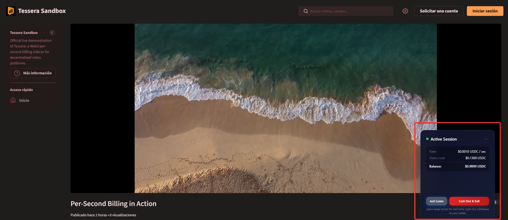
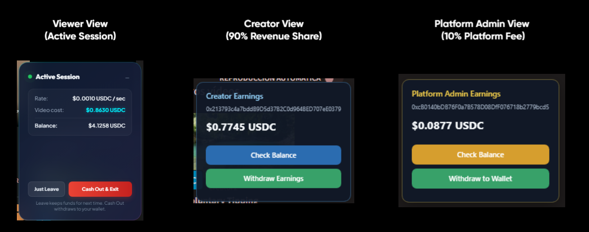
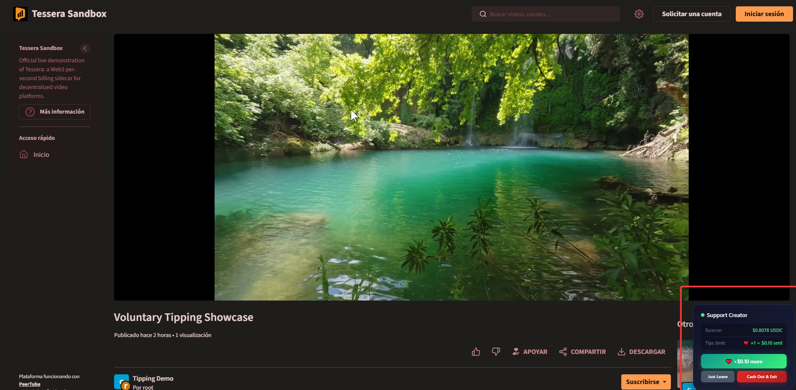

# Payment Models

The platform plugin picks **one mode per resource**: exclusive (per-second) or free (manual tip).

| Mode | Plugin UI | Billing |
|---|---|---|
| Exclusive | `initPaywall()` | HMAC `sessions/start` then `sessions/stop`. Sidecar pays `ratePerSecond` each second. |
| Free | `initTipMode(creatorWallet, amount)` | Browser `POST /v1/tips` when the viewer taps tip. No lock, no `start`. |

Fields, HMAC, and `userId`: [Connector spec](connectors/spec.md). Fees and Gateway: [Architecture](ARCHITECTURE.md).

---

## Exclusive (per-second)

Use this for video, live, or audio while it plays.

1. Overlay locks the player (`initPaywall`) until the viewer funds Gateway (`prepare-deposit`) and unlocks.
2. Plugin POSTs HMAC `sessions/start` with `ratePerSecond` and `payoutAddress`.
3. Each second the sidecar runs `GatewayClient.pay` to the creator (and optional `splits`).
4. HMAC `sessions/stop` or overlay **Just Leave** (`POST /end-session`) stops billing. Unused USDC stays in Gateway.
5. **Cash Out & Exit** (`POST /cash-out`) withdraws leftover Gateway USDC to the viewer's SCA.

The Active Session widget shows rate, video cost, and balance. Cost between refreshes is `seconds × rate`. Every 5 seconds the overlay reads `session-status` and `session-balance`.

`start` can include `splits` (each `{ address, fraction }`, sum `<= 1`). Remainder goes to `payoutAddress`. Tips have no splits.

---

## Free (manual tip)

Use this for photos, posts, or any item tagged `tessera:free`.

1. Overlay does not lock media (`initTipMode`).
2. Viewer funds Gateway, then taps the tip button.
3. Each tap POSTs `/api/core/v1/tips` with Circle proof. The sidecar pays that `amount` to `payoutAddress` immediately.
4. **Cash Out & Exit** withdraws leftover Gateway USDC to the SCA, same as exclusive.

The Support Creator widget shows Gateway balance and tips already sent. It refreshes balance every 5 seconds.

